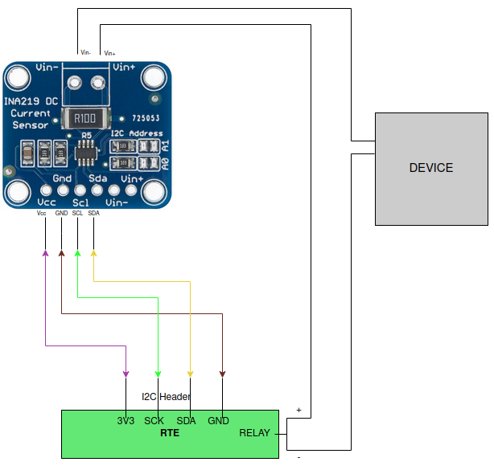

# Power Consumption

## Intro

The energy consumption of apu platforms is a topic worth paying attention to.
Power consumption is valuable with continuous software improvement. Thanks to
this information, it takes less time to detect errors.

## Setup testing environment

Measuring power consumption is possible thanks to the connection of
[RTE](https://docs.dasharo.com/transparent-validation/rte/introduction/) with
the [INA219](https://download.kamami.pl/p564714-ina219.pdf) sensor.RTE stands
for Remote Testing Environment and it is a tool that helps to debug and test
devices. RTE could be replaced by another device with an I2C header, but rest
assured it works with RTE. The INA219 is a current shunt and power monitor.
Connecting the RTE I2C header (J9) with the INA219 I2C header allows reading
information from the sensor:

 RTE I2C header (J9)        | INA219 I2C header
:--------------------------:|:---------------------------:
 1 (3V3)                    | (Vcc)
 2 (SCK)                    | (SCL)
 3 (SDA)                    | (SDA)
 4 (GND)                    | (GND)

The next step is to connect the appropriate wires to Vin- and Vin+. It is
required to cut one of the wires in the power cable running from RTE to the
device. The connection is made by cutting off the plus and connecting the cable
so that the part coming from RTE is connected to Vin +, and the part coming out
of the device to Vin-.



The values ​​from the sensor in the tests are normally read every 0.5s, but it is
a modifiable value. It is possible to read information about voltage(V),
current(A) and power(W) from the sensor. The following commands are used to read
the values ​​from the sensor:

```bash
cat /sys/class/hwmon/hwmon0/in1_input
cat /sys/class/hwmon/hwmon0/curr1_input
cat /sys/class/hwmon/hwmon0/power1_input
```

## Tests

### Apu stress-test CPU

A test case is following:

1. Power on RTE and power on apu3.
2. Boot to Debian 10 (buster) with kernel 4.19 on apu3.
3. Start measurements on RTE: constantly measure *bus voltage*, *current* and
   *input power* in 0.5 seconds time intervals and save them to a text file.
4. After 10 seconds from starting measurements, invoke `sysbench` command on
apu3.
5. When `sysbench` is finished, wait ~25 seconds and invoke the command again.
6. When `sysbench` command was invoked 10 times, finish the entire test.

## Presentation of the results

The test results are presented as charts based on the values ​​obtained during the
tests. Graphs or simple information on power consumption are available in the
PC-ENGINES newsletter.

## Plans for tests

Measurement plans in case of test development:

* at the start of the device

* during the memtest

* when the platform is constantly restarted
